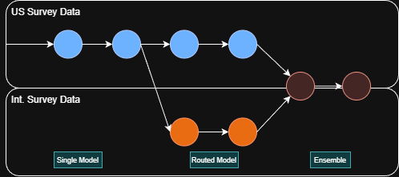
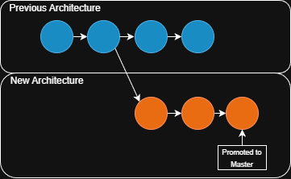

# Model Lifecycle Management

Managing a lifecycle for machine learning models is crucial for maintaining a process that ensures models remain effective and process smoothly from development to deployment and monitoring. Model lifecycle management is often overlooked in favor of focusing on model development, but it is equally important for ensuring that models continue to deliver value over time.

## Why model development is not always linear

Model development is often perceived as a linear process where a model is developed, trained, validated, and then deployed. However, in practice, the process is rarely linear. Models may need to be retrained, updated, or even rolled back to previous versions based on new data, changing requirements, or performance issues.This is why maintaining a model versioning system is crucial for tracking changes to models over time.

Lets review a few scenarios where model development may not be linear:

- **Retraining with new data:** Imagine a scenario where a model is trained to predict customer retention based on US survey responses. The model is deployed and performs well initially. However, a new set of international survey data becomes available, and the model needs to be retrained to incorporate this new data. When the model is retrained, it may perform significantly different with the new data requiring further tuning and validation before deployment.
The company then decides to maintain two versions of the model: one for US data and another for international data, requiring careful version management. Finally, they find that an ensemble model combining both versions performs best, leading to further complexity in model management.

- **Multiple Experiment branches:** In another scenario, a data science team is experimenting with different model architectures to improve performance on a fraud detection task. They create multiple branches of experiments, each with different feature sets and algorithms. Some experiments yield promising results, while others do not. The team needs to keep track of these different experiment branches, their results, and the models associated with each branch. This non-linear experimentation process requires robust model versioning to manage the various iterations effectively.

Clearly, model development can be a complex and non-linear process. An effective model lifecycle management strategy should be able to accommodate these complexities and provide a structured approach to managing models throughout their lifecycle.

## Key Stages in Model Lifecycle Management

In addition to versioning, models may progress to a full deployment is stages. Here are some key stages in the model lifecycle management process:

1. **Development:** This is the initial stage where models are developed, trained, and validated. Multiple versions of the model may be created during this stage as experiments are conducted.

2. **Testing:** In this stage, models are tested in a controlled environment to evaluate their performance. Models may be deployed to a staging environment where they can be tested with real-world data without impacting production systems.

3. **Shadow Deployment:** In this stage, models are deployed alongside existing production models but do not impact live traffic. This allows for real-world performance evaluation without risk.

4. **Canary Deployment:** In this stage, models are gradually rolled out to a small subset of users or traffic. This allows for monitoring and evaluation of the model's performance in a production environment before a full rollout.

5. **Full Deployment:** In this stage, the model is fully deployed to production and serves live traffic. Ongoing monitoring is essential to ensure the model continues to perform as expected.

6. **Monitoring and Maintenance:** After deployment, models need to be continuously monitored for performance degradation, data drift, and other issues. Models may need to be retrained or updated based on new data or changing requirements.

Effective model lifecycle management requires a combination of tools, processes, and best practices to ensure that models remain effective and deliver value over time.

## MLflow Model Registry

MLflow Model Registry can be a very useful tool for managing the model lifecycle. It provides a centralized repository for managing models, tracking their versions, and facilitating collaboration among team members. Users can track model assets through different stages of the lifecycle using the Model Registry's stage transitions (e.g., Staging, Production, Archived).

Additionally MLflow serving allows for easy deployment of models to various serving platforms, making it easier to transition models from development to production.

The model registry also supports adding tags and descriptions which can help for easy documentation of model changes and purposes.

## DVC Model Management

DVC (Data Version Control) also provides capabilities for managing the model lifecycle. DVC allows users to version control models alongside their code and data, making it easier to track changes and manage different versions of models.

While DVC does not have built-in stage transitions like MLflow Model Registry, users can implement their own lifecycle management processes using DVC's versioning capabilities. For example, users can create separate branches or tags in their DVC repository to represent different stages of the model lifecycle (e.g., development, staging, production).

DVC's integration with CI/CD pipelines can also facilitate automated testing and deployment of models, helping to streamline the transition from development to production.
