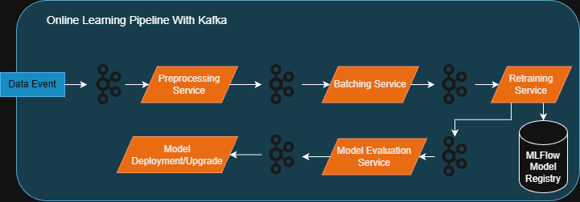

# Automated Retraining Pipelines and Tools

For online learning, automated retraining pipelines are essential to ensure that the model is consistently updated with new data. These pipelines should be designed to handle data ingestion, preprocessing, model training, evaluation, and deployment in an automated manner.

## Data Streams vs Batches

One important consideration when designing automated retraining pipelines is whether to process data in streams or batches.

Stream processing involves a continuous flow of data that is processed in real-time or near real-time. This approach is suitable for scenarios where data arrives continuously and needs to be processed immediately.

Batch processing on the other hand involves collecting data at intervals and processing it in chunks. This approach is suitable for scenarios where data can be collected over a period of time before being processed.

The choice between stream and batch processing may have major implications on the design of the retraining pipeline. For example, stream processing may be hosted on long running service that continuously receives and processes messages. Batch processing may be a scheduled job that runs at specific intervals (e.g., daily, hourly) or in response to specific triggers (e.g., N number of new data points collected).

## Apache Kafka 

Apache Kafka is a distributed event streaming platform that can be used to build real-time data pipelines and streaming applications.
Kafka can be used to ingest and process data streams for online learning applications. It provides a scalable and fault-tolerant architecture for handling large volumes of data in real-time.

For online learning that uses stream processing, Kafka can be used as a message broker to collect and distribute data streams to the retraining pipeline. The retraining pipeline can then process the incoming data in real-time, updating the model as new data arrives.

**Example** The following is a simple architecture diagram that illustrates how Kafka can be used in an online learning retraining pipeline. It includes microservices for data preprocessing, data batching, model training, model evaluation, and model deployment.

## Apache Airflow

Apache Airflow is an open-source platform to programmatically author, schedule, and monitor workflows. It can be used to build automated retraining pipelines for online learning applications.

Airflow is built around the concept of Directed Acyclic Graphs (DAGs), which represent workflows as a series of tasks with dependencies. This makes it easy to define complex retraining pipelines that involve multiple steps, such as data ingestion, preprocessing, model training, evaluation, and deployment.

Airflow would be a good choice for building retraining pipelines that use batch processing. For example, a DAG could be scheduled to run at specific intervals (e.g., daily, hourly) to collect new data, preprocess it, train the model, evaluate its performance, and deploy the updated model if it meets certain criteria.