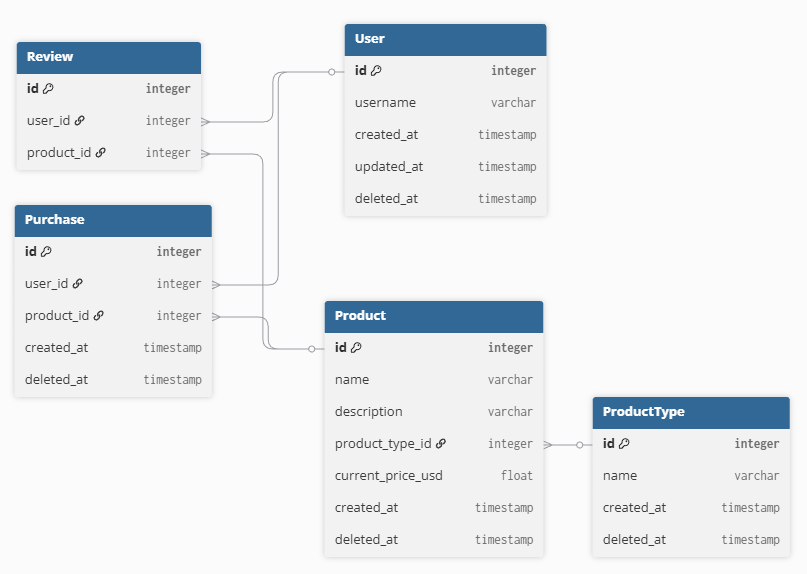

# Inital Database Setup

For this case study, we will imagine that the company already has a relational database setup to store user information, product details, and historical purchase data. We will give a similified schema for the database below:

## AI Data Setup

To support the development and research of a recommendation system, we need to establish a robust dataset that can be used for training and evaluating recommendation algorithms. We would like to continiously version the dataset to ensure that any updates to the data can be tracked and reproduced.

We will note a few key features of this dataset that contribute to our design:

- **Large Volume of Data:** The purchase history table may contains millions of records. Ideally, we would like to use a majority of this data for training our recommendation models.

- **User Interactions for Labels:** We can automatically gather labels from user based on their interactions with products. For example, purchases can be used as a positive signal for recommendation relevance. In addition, if the user views a product's details page but does not make a purchase, this can be used as a negative signal. In addition, we can also consider a user adding a product to their wishlist as a positive signal.

- **Temporal Dynamics:** When making predictions about a users preferences, it is important that we only consider the previous interactions that the user has had up to that point in time. For example, if a user made a purchase on January 15th, 2023, we should not use any interactions that occurred after that date when making recommendations for that purchase. This requires careful handling of timestamps and ensuring that the training data is constructed in a way that respects the temporal order of events.

## Recommended AI Data Storage Solution

Given the requirements outlined above, we recommend using a relational database to store a copy of the data needed for training and evaluating the recommendation models. The structure of the database will be modified to improve temporal querying capabilities. In particular, we will use a PostgreSQL database with a snowflak schema design to optimize for querying user interactions over time.

### Snowflake Schema Design

The following are the key components of the snowflake schema design for our recommendation system dataset:

- **Fact Table: User Interactions**
  - This table will store all user interactions with products, including views, purchases, and wishlist additions.
  - Key columns: interaction_id (PK), user_id (FK), product_id (FK), interaction_type (view, purchase, wishlist), interaction_timestamp

- **Fact Table: Product Details**
  - This table will store detailed information about each product.
  - Key columns: product_id (PK), product_name, category_id (FK), price, brand_id (FK)

- **Dimension Table: Users**
  - This table will store user information.
  - Key columns: user_id (PK), user_name, email, signup_date

- **Dimension Table: Categories**
  - This table will store product category information.
  - Key columns: category_id (PK), category_name, parent_category_id (FK)

- **Dimension Table: Brands**
  - This table will store brand information.
  - Key columns: brand_id (PK), brand_name, country_of_origin

### Data Migration Process

For the data to be migrated to the new PostgreSQL database, we will follow these steps:

1. **Change Tracking:** Implement change tracking on the existing database to capture any updates to user interactions, product details, and other relevant tables.

2. **Event Steaming to Kafka:** Set up a Kafka pipeline to stream changes from the existing database to the new PostgreSQL database in near real-time. The consumers will read from the Kafka topics and insert the raw data into staging tables in PostgreSQL.

3. **ETL Process:** Develop an ETL (Extract, Transform, Load) process to transform the raw data in the staging tables into the snowflake schema format. This process will handle data cleaning, deduplication, and transformation to ensure data quality.

### Data Versioning

To ensure reproducibility and traceability of the dataset, we will implement a data versioning strategy using DVC (Data Version Control). The following steps outline the data versioning process:

1. **Dataset Repository:** Create a DVC repository to manage the different version of the dataset. The Repository will have the following components:
    - DVC files storing the raw data extracted from the PostgresSQL database. These files may be stored as CSV or Parquet files.
    - Dockerfile and scripts to initialize and update local or cloud-hosted copies of the PostgreSQL database for training and evaluation.
    - SQL scripts and libraries for common data preprocessing tasks.

2. **Update Process:** At each time interval (e.g., daily, weekly), the ETL process will be run to extract the latest data from the PostgreSQL database and update the dataset in the DVC repository. A new DVC version will be created to capture the changes.

3. **Global Statistics:** In addition to versioning the raw data, we will also include some global statistics about the extracted dataset. These statistics will help us to guage both the quality of the data and its evolution over time. These may include:
    - Total number of "Positive" interactions (purchases, wishlist additions).
    - Total number of "Negative" interactions (product views without purchase).
    - Distribution of interactions over time (e.g., number of interactions per day/week).
    - Frequency of interactions per user and per product. These statistics will help in understanding the dataset and its evolution over time.

4. **Reproducibility:** When training or evaluating models, data scientists can checkout specific versions of the dataset from the DVC repository to ensure that they are using the exact same data used in previous experiments. This will help in reproducing results and comparing model performance across different dataset versions.

